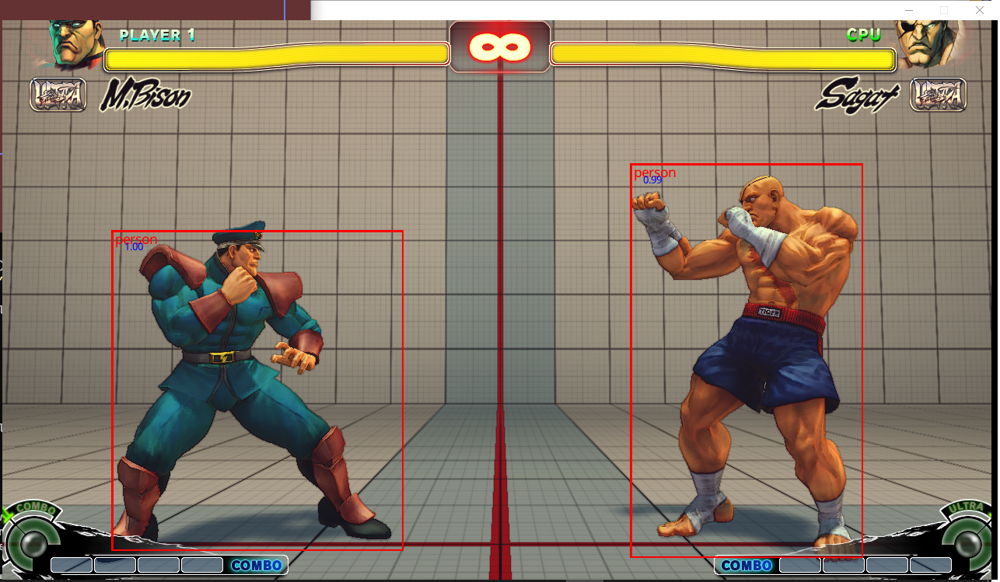

yolov4_tiny_rs is a rust implementation of the yolov4_tiny algorithm using nvidia's cuda libraries. 

This is a minimal implementation which only preforms inference. 

The original paper for YOLOv4 can be found here: https://arxiv.org/abs/2004.10934
The author's personal site can be found here: https://pjreddie.com/darknet/yolo/

#Setup
Compile and run this software Nvidia's cuda, cutensor, cudnn, and cublas libraries must be installed.
The software uses CUDA 11.4.
On windows it is expected that the relevant binaries can be found in `C:\\Program Files\\NVIDIA GPU Computing Toolkit\\CUDA\\v11.4\\lib\\x64\\` . 
On linux `/usr/local/cuda/include` .
If you have installed the cuda dependencies in a different location you will need to update the cuda rs build files accordingly.

An external set of weights is needed to preform inference. 
The weights can be found [here](https://1drv.ms:443/u/s!BGiQd8FswuzLsDKbg_p66EcXf1LZ?e=IvV84ojpWUGq-sUIK0jDnw&at=9).
Once downloaded place the weights `yolov4_tiny_tg` in the data folder.

#Run
NOTE: while the linux version compiles it does not complete the inference phase. This issue is currently being investigated and hopefully corrected soon.
To run `cargo run (--release) <input_file_name> -o <optional_output_file_name>`.
The output file will render any bounding boxes, class names and confidence scores to a copy of the original image.

#TODO
- user defined score criteria
- Fix linux implementation
- implement macOs implementation
- implement an sensible automatic deallocation systems, probably ref-counting.

